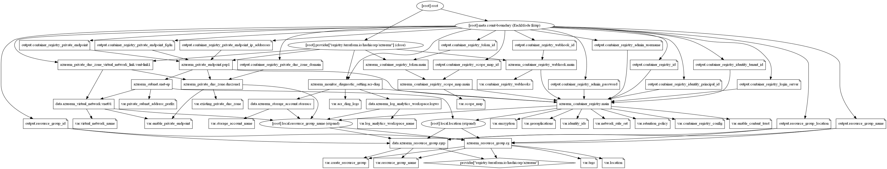

# Azure Container Registry Terraform Module

The Azure container registry is Microsoft's hosting platform for Docker images. It is a private registry where you can store and manage the private Docker container images and other related artefacts. These images can then be pulled and run locally or used for container-based deployments to hosting platforms.

This Terraform module helps create Azure Container Registry with optional scope-map, token, webhook, Network ACLs, encryption and Private endpoints.

## Resources supported

- [Container Registry](https://registry.terraform.io/providers/hashicorp/azurerm/latest/docs/resources/container_registry)
- [Container Registry Encryption with Customer Managed Key](https://registry.terraform.io/providers/hashicorp/azurerm/latest/docs/resources/container_registry#encryption)
- [Container Registry Georeplications](https://registry.terraform.io/providers/hashicorp/azurerm/latest/docs/resources/container_registry#georeplications)
- [Container Registry Token](https://registry.terraform.io/providers/hashicorp/azurerm/latest/docs/resources/container_registry_token) [with repository-scoped permissions](https://registry.terraform.io/providers/hashicorp/azurerm/latest/docs/resources/container_registry_scope_map)
- [retention policy for untagged manifests](https://registry.terraform.io/providers/hashicorp/azurerm/latest/docs/resources/container_registry#retention_policy)
- [Content trust in Azure Container Registry](https://registry.terraform.io/providers/hashicorp/azurerm/latest/docs/resources/container_registry#trust_policy)
- [Container Registry Webhooks](https://registry.terraform.io/providers/hashicorp/azurerm/latest/docs/resources/container_registry_webhook)
- [Restrict access using a service endpoint](https://registry.terraform.io/providers/hashicorp/azurerm/latest/docs/resources/container_registry#network_rule_set)
- [Private Endpoints - Private Link to Azure Contaner Registry](https://docs.microsoft.com/en-us/azure/container-registry/container-registry-private-link)

## Module Usage

```terraform
# Azurerm Provider configuration
provider "azurerm" {
  features {}
}

module "container-registry" {
  source  = "kumarvna/container-registry/azurerm"
  version = "1.0.0"

  # By default, this module will not create a resource group. Location will be same as existing RG.
  # proivde a name to use an existing resource group, specify the existing resource group name, 
  # set the argument to `create_resource_group = true` to create new resrouce group.
  resource_group_name = "rg-shared-westeurope-01"
  location            = "westeurope"

  # Azure Container Registry configuration
  # The `Classic` SKU is Deprecated and will no longer be available for new resources
  container_registry_config = {
    name          = "containerregistrydemoproject01"
    admin_enabled = true
    sku           = "Premium"
  }

  # The georeplications is only supported on new resources with the Premium SKU.
  # The georeplications list cannot contain the location where the Container Registry exists.
  georeplications = [
    {
      location                = "northeurope"
      zone_redundancy_enabled = true
    },
    {
      location                = "francecentral"
      zone_redundancy_enabled = true
    },
    {
      location                = "uksouth"
      zone_redundancy_enabled = true
    }
  ]

  # (Optional) To enable Azure Monitoring for Azure MySQL database
  # (Optional) Specify `storage_account_name` to save monitoring logs to storage. 
  log_analytics_workspace_name = "loganalytics-we-sharedtest2"

  # Adding TAG's to your Azure resources 
  tags = {
    ProjectName  = "demo-internal"
    Env          = "dev"
    Owner        = "user@example.com"
    BusinessUnit = "CORP"
    ServiceClass = "Gold"
  }
}
```

## Module Usage examples for

- [Hdinsight Hadoop Cluster](examples/hdinsight_hadoop_cluster/README.md)
- [Hdinsight HBase Cluster](examples/hdinsight_hbase_cluster/README.md)
- [Hdinsight Interactive Query Cluster](examples/hdinsight_interactive_query_cluster/README.md)
- [Hdinsight Kafka Cluster](examples/hdinsight_kafka_cluster/README.md)
- [Hdinsight Spark Cluster](examples/hdinsight_spark_cluster/README.md)

## Advanced Usage of the Module

### **`network_rule_set`** - Restrict access using a service endpoint

Azure Virtual Network provides secure, private networking for your Azure and on-premises resources. A service endpoint allows you to secure your container registry's public IP address to only your virtual network. This endpoint gives traffic an optimal route to the resource over the Azure backbone network. The identities of the virtual network and the subnet are also transmitted with each request.

Add following to module configuration with a valid IP range and Subnet ids to implement network ACL's. Add `Microsoft.ContainerRegistry` to subnet's ServiceEndpoints collection before adding specific subnets.

```terraform
# Azurerm Provider configuration
provider "azurerm" {
  features {}
}

module "container-registry" {
  source  = "kumarvna/container-registry/azurerm"
  version = "1.0.0"

 # .... omitted

  network_rule_set = {
    default_action = "Deny"
    ip_rule = [
      {
        ip_range = "49.204.225.49/32"
      },
    ]
    virtual_network = [
      {
        subnet_id = "/subscriptions/1e3f0eeb-0000-1111-0000-101010101010/resourceGroups/rg-shared-westeurope-01/providers/Microsoft.Network/virtualNetworks/vnet-shared-hub-westeurope-001/subnets/snet-appgateway"
      },
      {
        subnet_id = "/subscriptions/1e3f0eeb-0000-1111-0000-101010101010/resourceGroups/rg-shared-westeurope-01/providers/Microsoft.Network/virtualNetworks/vnet-shared-hub-westeurope-001/subnets/snet-management"
      }
    ]
  }

 # .... omitted
}
```

### **`scope_map`** - Create a token with repository-scoped permissions

By creating tokens, a registry owner can provide users or services with scoped, time-limited access to repositories to pull or push images or perform other actions. A token provides more fine-grained permissions than other registry authentication options, which scope permissions to an entire registry.

> [!IMPORTANT]
>
> - This feature is currently in preview, and some [limitations apply](https://docs.microsoft.com/en-us/azure/container-registry/container-registry-repository-scoped-permissions#preview-limitations).
> - You can't currently assign repository-scoped permissions to an Azure Active Directory identity, such as a service principal or managed identity.
> - You can't create a scope map in a registry enabled for anonymous pull access.

```terraform
# Azurerm Provider configuration
provider "azurerm" {
  features {}
}

module "container-registry" {
  source  = "kumarvna/container-registry/azurerm"
  version = "1.0.0"

 # .... omitted

  scope_map = {
    example-scope-map1 = {
      actions = [
        "repo/content/read",
        "repo2/content/delete"
      ]
    },
    example-scope-map2 = {
      actions = [
        #       "content/tomcat/read",
        "repo/content/read",
        "repo2/content/delete"
      ]
    }
  }

 # .... omitted
}
```

### **`container_registry_webhook`** - Using Azure Container Registry webhooks

An Azure container registry stores and manages private Docker container images, similar to the way Docker Hub stores public Docker images. It can also host repositories for Helm charts (preview), a packaging format to deploy applications to Kubernetes. You can use webhooks to trigger events when certain actions take place in one of your registry repositories. Webhooks can respond to events at the registry level, or they can be scoped down to a specific repository tag. With a geo-replicated registry, you configure each webhook to respond to events in a specific regional replica.

The endpoint for a webhook must be publicly accessible from the registry. You can configure registry webhook requests to authenticate to a secured endpoint. This module support webhooks creation using following object map.

```terraform
# Azurerm Provider configuration
provider "azurerm" {
  features {}
}

module "container-registry" {
  source  = "kumarvna/container-registry/azurerm"
  version = "1.0.0"

 # .... omitted

  container_registry_webhooks = {
    webhook1 = {
      service_uri = "https://mywebhookreceiver.example/mytag"
      status      = "enabled"
      scope       = "mytag:*"
      actions     = ["push"]
      custom_headers = {
        "Content-Type" = "application/json"
      }
    },
    webhook2 = {
      service_uri = "https://mywebhookreceiver.example/app1"
      status      = "enabled"
      scope       = "app1:*"
      actions     = ["push"]
      custom_headers = {
        "Content-Type" = "application/json"
      }
    }
  }

 # .... omitted
}
```

### **`encryption`** - Encrypt registry using a customer-managed key

When you store images and other artifacts in an Azure container registry, Azure automatically encrypts the registry content at rest with service-managed keys. You can supplement default encryption with an additional encryption layer using a key that you create and manage in Azure Key Vault (a customer-managed key).

This module supports encryption using customer managed key using keyvalut by adding following configuration to module. The managed identity used in `encryption` also needs to be part of the `identity` block under `identity_ids`.

```terraform
# Azurerm Provider configuration
provider "azurerm" {
  features {}
}

resource "azurerm_user_assigned_identity" "example" {
  resource_group_name = azurerm_resource_group.example.name
  location            = azurerm_resource_group.example.location
  name                = "registry-uai"
}

data "azurerm_key_vault_key" "example" {
  name         = "super-secret"
  key_vault_id = data.azurerm_key_vault.existing.id
}

module "container-registry" {
  source  = "kumarvna/container-registry/azurerm"
  version = "1.0.0"

 # .... omitted

  identity_ids = [azurerm_user_assigned_identity.example.client_id]
  
  encryption = {
    key_vault_key_id   = data.azurerm_key_vault_key.example.id
    identity_client_id = azurerm_user_assigned_identity.example.client_id
  }

 # .... omitted
}
```

### **`retention_policy`** - Set a retention policy for untagged manifests

Azure Container Registry gives you the option to set a retention policy for stored image manifests that don't have any associated tags (untagged manifests). When a retention policy is enabled, untagged manifests in the registry are automatically deleted after a number of days you set. This feature prevents the registry from filling up with artifacts that aren't needed and helps you save on storage costs.

> The retention policy applies only to untagged manifests with timestamps after the policy is enabled. Untagged manifests in the registry with earlier timestamps aren't subject to the policy.

```terraform
# Azurerm Provider configuration
provider "azurerm" {
  features {}
}

module "container-registry" {
  source  = "kumarvna/container-registry/azurerm"
  version = "1.0.0"

 # .... omitted

  # Set a retention policy with care--deleted image data is UNRECOVERABLE.
  # A retention policy for untagged manifests is currently a preview feature of Premium container registries
  # The retention policy applies only to untagged manifests with timestamps after the policy is enabled. Default is `7` days.
  retention_policy = {
    days    = 10
    enabled = true
  }

 # .... omitted
}
```

### **`trust_policy`** - Content trust in Azure Container Registry

Azure Container Registry implements Docker's content trust model, enabling pushing and pulling of signed images. This module supports the feature and can be implemneted by setting up `enable_content_trust = true`.

### Private Link to Azure Contaner Registry

Azure Private Endpoint is a network interface that connects you privately and securely to a service powered by Azure Private Link. Private Endpoint uses a private IP address from your VNet, effectively bringing the service into your VNet.

With Private Link, Microsoft offering the ability to associate a logical server to a specific private IP address (also known as private endpoint) within the VNet. Clients can connect to the Private endpoint from the same VNet, peered VNet in same region, or via VNet-to-VNet connection across regions. Additionally, clients can connect from on-premises using ExpressRoute, private peering, or VPN tunneling.

By default, this feature not enabled on this module. To create private link with private endpoints set the variable `enable_private_endpoint` to `true` and provide `virtual_network_name`, `private_subnet_address_prefix` with a valid values. You can also use the existing private DNS zone to create DNS records. To use this feature, set the `existing_private_dns_zone` with a valid existing private DNS zone name.

For more details: [Connect privately to an Azure container registry using Azure Private Link](https://docs.microsoft.com/en-us/azure/container-registry/container-registry-private-link)

> [!IMPORTANT]
>
> Some functionality may be unavailable or require more configuration in a container registry that restricts access to private endpoints, selected subnets, or IP addresses.
>
> - When public network access to a registry is disabled, registry access by certain trusted services including Azure Security Center requires enabling a network setting to bypass the network rules.
> - Instances of certain Azure services including Azure DevOps Services and Azure Container Instances are currently unable to access the container registry.
> - If the registry has an approved private endpoint and public network access is disabled, repositories and tags can't be listed outside the virtual network using the Azure portal, Azure CLI, or other tools.
>

## Recommended naming and tagging conventions

Applying tags to your Azure resources, resource groups, and subscriptions to logically organize them into a taxonomy. Each tag consists of a name and a value pair. For example, you can apply the name `Environment` and the value `Production` to all the resources in production.
For recommendations on how to implement a tagging strategy, see Resource naming and tagging decision guide.

>**Important** :
Tag names are case-insensitive for operations. A tag with a tag name, regardless of the casing, is updated or retrieved. However, the resource provider might keep the casing you provide for the tag name. You'll see that casing in cost reports. **Tag values are case-sensitive.**

An effective naming convention assembles resource names by using important resource information as parts of a resource's name. For example, using these [recommended naming conventions](https://docs.microsoft.com/en-us/azure/cloud-adoption-framework/ready/azure-best-practices/naming-and-tagging#example-names), a public IP resource for a production SharePoint workload is named like this: `pip-sharepoint-prod-westus-001`.

## Requirements

| Name | Version |
|------|---------|
| terraform | >= 0.13 |
| azurerm | >= 2.59.0 |

## Providers

| Name | Version |
|------|---------|
| azurerm | >= 2.59.0 |


## Inputs

| Name | Description | Type | Default |
|--|--|--|--|
`create_resource_group` | Whether to create resource group and use it for all networking resources | string | `"false"`
`resource_group_name` | The name of the resource group in which resources are created | string | `""`
`location` | The location of the resource group in which resources are created | string | `""`
`log_analytics_workspace_name`|The name of log analytics workspace name|string|`null`
`storage_account_name`|The name of the storage account name|string|`null`
`enable_private_endpoint`|Azure Private Endpoint is a network interface that connects you privately and securely to a service powered by Azure Private Link|string|`"false"`
`virtual_network_name` | The name of the virtual network|string|`""`
`private_subnet_address_prefix`|A list of subnets address prefixes inside virtual network| list |`[]`
`existing_private_dns_zone`|Name of the existing private DNS zone|string|`null`
`Tags` | A map of tags to add to all resources | map | `{}`

## Outputs

| Name | Description |
|--|--|
`resource_group_name`|The name of the resource group in which resources are created
`resource_group_location`|The location of the resource group in which resources are created

## Resource Graph



## Authors

Originally created by [Kumaraswamy Vithanala](mailto:kumarvna@gmail.com)

## Other resources

- [Azure database for MariaDB](https://docs.microsoft.com/en-us/azure/mariadb/)
- [Terraform AzureRM Provider Documentation](https://www.terraform.io/docs/providers/azurerm/index.html)
